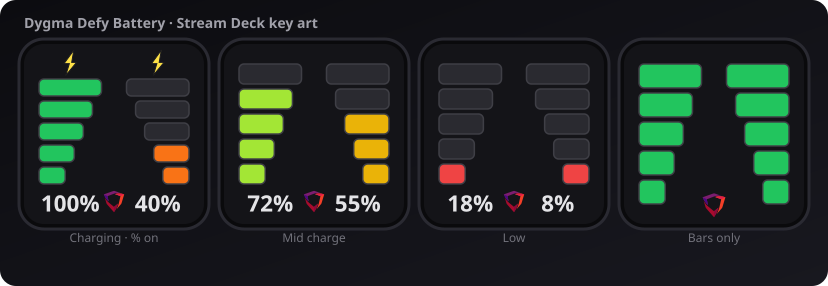

# dygma-sd — Dygma wireless battery on Stream Deck

Native **Stream Deck plugin** (Rust) that reads wireless battery levels from a Dygma Neuron over Focus serial and shows them on a key.

<p align="center">
  
</p>

Works with **wireless split** boards that expose Focus `wireless.battery.*` (verified on **Defy**; expected on **Raise 2** wireless). Pure Bluetooth mode is **not** supported (no Focus serial without Neuron USB).

| Piece | Tech |
|-------|------|
| Focus / battery | [`dygma_focus`](https://crates.io/crates/dygma_focus) |
| Stream Deck protocol | [`streamdeck-rs`](https://crates.io/crates/streamdeck-rs) |
| Runtime | Native `.exe` launched by Stream Deck |

**Plugin author:** Eminence · **UUID:** `com.red.eminence.dygma.battery`

> **Disclaimer:** This is an **unofficial** community plugin. It is **not** made by, affiliated with, or endorsed by Dygma Lab SL. It is provided **as-is, with no warranty or guarantee** of any kind. **Use at your own risk.**

## Requirements

| Item | Notes |
|------|--------|
| Neuron USB | Focus COM port (e.g. COM4, `VID_35EF` / `PID_0012` on Defy) |
| Sides | RF to Neuron (not side USB cables) |
| Bazecor | **Closed** while the plugin owns the serial port |
| Stream Deck | 6.4+ |
| Build | Rust (MSVC) + C++ Build Tools / Windows SDK (`link.exe`) |

Bluetooth-only (Neuron under left half, no USB) does **not** expose Focus serial.

## Features

- Action **Dygma → Defy Battery**
- **SVG key art:** two vertical 5-block bars (L left-aligned, R right-aligned; bottom blocks narrower)
- Colors by charge: green (high) → lime → yellow → orange → red (≤20%)
- Tiny **Dygma mark** centered at the bottom of the key (between L/R %)
- Optional **% text** under each bar (property inspector)
- **Charging bolt** when Focus status is **1 or 2** (Defy FW 2.2.1 uses `1` while charging; older docs list `2`)
- **Device picker** when multiple Neurons are on USB (per-key setting; auto = first available)
- Auto-poll (default **60 s**, min 15 / max 600)
- **Key press** forces `wireless.battery.forceRead` + refresh

## Install (end users)

### From GitHub Release (recommended)

1. Open the latest [Release](https://github.com/crimsonvspurple/dygma-sd/releases).
2. Download **`com.red.eminence.dygma.battery.streamDeckPlugin`**.
3. Double-click to install into Stream Deck.
4. Add **Dygma → Defy Battery** to a key.
5. **Close Bazecor** while the plugin owns the Neuron COM port.

Releases are built by GitHub Actions on version tags (`v0.1.0`, …).

### From source (developers)

#### One-time: C++ build tools

```powershell
winget install Microsoft.VisualStudio.BuildTools `
  --override "--wait --passive --add Microsoft.VisualStudio.Workload.VCTools --includeRecommended"
```

#### Install into Stream Deck

```powershell
cd plugin
.\scripts\install.ps1
```

This generates icons, builds release, copies  
`com.red.eminence.dygma.battery.sdPlugin` →  
`%APPDATA%\Elgato\StreamDeck\Plugins\`, and restarts Stream Deck.

#### Pack a release artifact locally

```powershell
# Optional: npm i -g @elgato/cli   # for streamdeck pack + validate
.\plugin\scripts\pack.ps1
# → dist/*.streamDeckPlugin and dist/*.sdPlugin.zip
```

#### Publish a GitHub Release via Actions

```powershell
git tag v0.1.0
git push origin v0.1.0
```

Or run the **Release** workflow manually from the Actions tab.

### Self-test (no Stream Deck)

Lists Focus devices, then reads battery from the first available Neuron:

```powershell
cd plugin
cargo run --release -- --self-test
```

### Unit tests

```powershell
cd plugin
cargo test
```

## Project layout

```text
dygma-defy-battery-instructions.md   # Focus API notes
plugin/
  Cargo.toml
  src/
    main.rs       # entry, --self-test, select! event loop
    plugin.rs     # per-key state, device selection, SD handlers
    battery.rs    # dygma_focus list/read + tests
    visual.rs     # SVG key art
    error.rs      # PluginError
  com.red.eminence.dygma.battery.sdPlugin/
    manifest.json
    ui/property-inspector.html
    imgs/
  scripts/
    gen-icons.ps1
    install.ps1
    pack.ps1          # build + package for GitHub Release
.github/workflows/
  release.yml         # tag v* → build → GitHub Release
```

## Focus protocol (reference)

```
wireless.battery.forceRead     # then wait ~2s
wireless.battery.left.level
wireless.battery.right.level
wireless.battery.left.status
wireless.battery.right.status
```

See `dygma-defy-battery-instructions.md` for details and caveats.

## Caveats

- **One process owns each COM port** — close Bazecor while the plugin is active.
- Status codes vary by firmware; charging bolt accepts `1` and `2`.
- Wired charging sides often hide reliable % (hardware fuel-gauge limit).
- Pure Bluetooth mode is not supported (no Focus serial).

## Disclaimer & trademark

This project is an **unofficial** community plugin. It is **not** an official Dygma product and is **not** made by, affiliated with, or endorsed by Dygma Lab SL (or Elgato / Corsair).

The software is provided **as-is**, **without warranty or guarantee** of any kind — including fitness for a particular purpose, uninterrupted operation, or that it will not interfere with Bazecor, firmware, or hardware. **Use at your own risk.**

The Dygma name and logo mark appear only to identify compatibility with Dygma keyboards.
